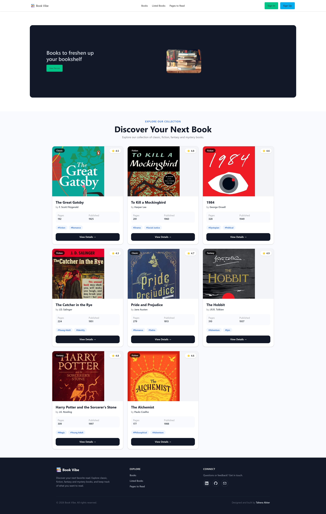

# 🚀 BookVibe

BookVibe is a React-based online book browsing and reading platform where users can explore different books, view book details, and manage their reading list.

I built this project to practice React fundamentals and create a user-friendly interface for browsing and managing books.

## 📸 Project Screenshot

## 🛠️ Technologies Used

The main technologies and tools I used to build this project are:

| Technology | Purpose |
|---|---|
| React.js | Building the user interface |
| JavaScript (ES6+) | Application logic and functionality |
| React Router | Handling navigation between pages |
| Tailwind CSS | Styling and responsive design |
| Vite | Development server and build tool |
| JSON | Storing and managing book data |

## ✨ Main Features

### 1. Browse Books

Users can browse different books available on the website and explore the available collection through a clean and responsive interface.

### 2. Book Details

Users can select a book and view more detailed information about it.

### 3. Reading List

Users can add books to their personal reading list.

### 4. Interactive User Interface

The interface updates based on user interactions.

I used React concepts such as:

- Components
- Props
- State
- Event handling
- `.map()`
- Conditional rendering
- Reusable components

## 📦 Dependencies

Some of the main packages used in this project are:

- react
- react-dom
- react-router-dom

The complete list of dependencies can be found in the project's package.json file.

## 📦 Dependencies

Some of the main packages used in this project are:

- react
- react-dom
- react-router-dom

The complete list of dependencies can be found in the project's package.json file.

## 🔗 Relevant Links

🌐 Live Demo: [BookVibe](https://book-vibe-project-theta.vercel.app/)

💻 GitHub: [GitHub Repository](https://github.com/TaheraScript/BookVibe-Next.js)

⚛️ React: [https://react.dev/](https://react.dev/)

🧭 React Router: [https://reactrouter.com/](https://reactrouter.com/)

⚡ Vite: [https://vite.dev/](https://vite.dev/)

🎨 Tailwind CSS: [https://tailwindcss.com/](https://tailwindcss.com/)

